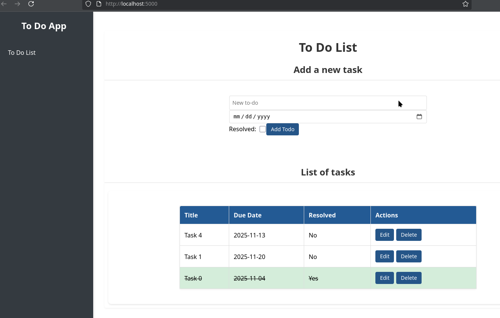

# Django TO-DO App

A simple TO-DO application built with Django and React. It provides an easy-to-use platform for users to create, edit, and delete to-do tasks, with a focus on clean, maintainable code and responsive design.




## Features

* Create, edit and delete TODOs
* Assign due dates
* Mark TODOs as resolved

  

## Technologies:
* Django
* React (JavaScript)

  

## Future Improvements:

* Implement user authentication
* Implement user profiles with additional customization options.

  

## Setup

The first step is cloning this repository and then follow the setup steps of backend (Django) and frontend (React - JavaScript).

### Django Backend

#### Install the required dependencies

```bash
pip install -r requirements.txt
```

#### Run database migrations

```bash
python manage.py migrate
```


#### Start the Django development server very 
```bash
python manage.py runserver
```

The Django backend should be running at `http://127.0.0.1:8000`.

### React Frontend

#### Install the required dependencies

- `package.json`: List of Node.js dependencies.
- `package-lock.json` (or `yarn.lock`): Locks versions of your Node.js dependencies.


#### Start the React development server 

```bash
npm run dev
```

- The React frontend should be running at `http://localhost:5000`.


# Tests

## Backend
* Test 01: Create a todo task with all fields
* Test 02: Creating a todo task with only required fields


